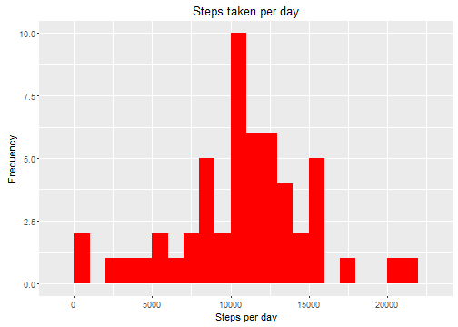
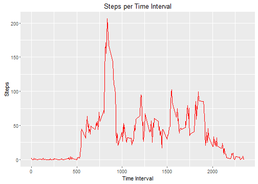
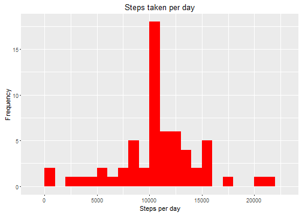
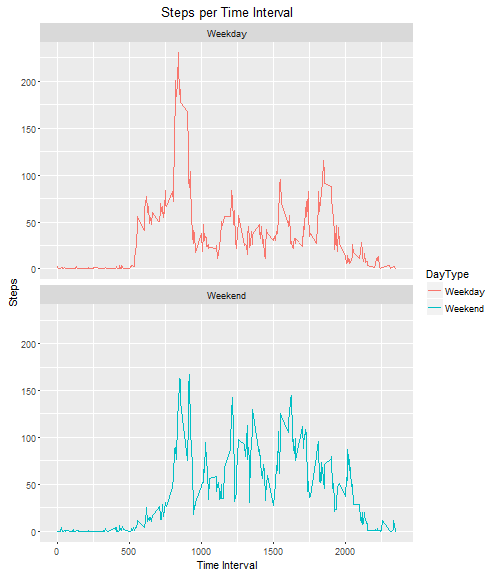

## Introduction
This assignment makes use of data from a personal activity monitoring device. This device collects data at 5 minute intervals through out the day. The data consists of two months of data from an anonymous individual collected during the months of October and November, 2012 and include the number of steps taken in 5 minute intervals each day. 

This document presents the results from Project Assignment 1 in the Coursera course Reproducible Research, written in a single R markdown document that can be processed by knitr and transformed into an HTML file.


## Preparing the R Environment

The following libaries were loaded to prepare the R environment for the code that was used to achieve the results.


```r
library(dplyr)
library(lubridate)
library(ggplot2)
```


## Loading and preprocessing the data

The data Used for this investigation can be found at the following location <https://d396qusza40orc.cloudfront.net/repdata%2Fdata%2Factivity.zip>.

Show any code that is needed to:

#### 1) Load the data (i.e. read.csv())


```r
  # Check if the file has been unzipped before commencing
if(!file.exists("./data")){
  dir.create("./data")
}
  # Unzip the downloaded file
if(!file.exists("./activity.csv")){
  unzip(zipfile="./repdata-data-activity.zip",exdir="./data")
}

  # Set the working directory
setwd("./data")       

# Import the datasets
ActivityData  <- read.table("./activity.csv", header = TRUE, sep = ",", stringsAsFactors = FALSE)
```

#### 2) Process/transform the data (if necessary) into a format suitable for your analysis


```r
ActivityData$date  <- ymd(ActivityData$date)
```

The data has now been imported and cleansed for use in the investigation.


## What is mean total number of steps taken per day?

For this part of the assignment, you can ignore the missing values in the dataset.

#### 1) Calculate the total number of steps taken per day


```r
StepsPerDay <- ActivityData %>% 
    filter(!is.na(steps)) %>%
    group_by(date)  %>%
    summarize(steps = sum(steps))

StepsPerDay
```

```
## Source: local data frame [53 x 2]
## 
##          date steps
##        (time) (int)
## 1  2012-10-02   126
## 2  2012-10-03 11352
## 3  2012-10-04 12116
## 4  2012-10-05 13294
## 5  2012-10-06 15420
## 6  2012-10-07 11015
## 7  2012-10-09 12811
## 8  2012-10-10  9900
## 9  2012-10-11 10304
## 10 2012-10-12 17382
## ..        ...   ...
```
#### 2) Make a histogram of the total number of steps taken each day


```r
ggplot(data = StepsPerDay, aes(as.numeric(steps))) + geom_histogram(fill = "red", binwidth = 1000) +
         labs(title = "Steps taken per day", x = "Steps per day", y = "Frequency")
```

 

#### 3) Calculate and report the mean and median of the total number of steps taken per day


```r
MeanSteps <- mean(StepsPerDay$steps, na.rm = "TRUE")
MedianSteps <- median(StepsPerDay$steps, na.rm = "TRUE")

MeanSteps
```

```
## [1] 10766.19
```

```r
MedianSteps
```

```
## [1] 10765
```

The mean steps are 10766.19 and the median steps taken are 10765.


##What is the average daily activity pattern?

#### 1) Make a time series plot (i.e. type = "l") of the 5-minute interval (x-axis) and the average number of steps taken, averaged across all days (y-axis)


```r
Interval_Plot <- ActivityData %>%
    filter(!is.na(steps))     %>%
    group_by(interval)        %>%
    summarize(steps = mean(steps))

ggplot(Interval_Plot, aes(x=interval, y=steps)) +
  geom_line(color = "red") +
  labs(title = "Steps per Time Interval", x = "Time Interval", y = "Steps")
```

 


#### 2) Which 5-minute interval, on average across all the days in the dataset, contains the maximum number of steps?


```r
MaxSteps <- Interval_Plot[which.max(Interval_Plot$steps),]
MaxSteps
```

```
## Source: local data frame [1 x 2]
## 
##   interval    steps
##      (int)    (dbl)
## 1      835 206.1698
```


## Imputing missing values

Note that there are a number of days/intervals where there are missing values (coded as NA). The presence of missing days may introduce bias into some calculations or summaries of the data.

#### 1) Calculate and report the total number of missing values in the dataset (i.e. the total number of rows with NAs)


```r
MissingVal <- sum(is.na(ActivityData$steps))
MissingVal
```

```
## [1] 2304
```

#### 2) Devise a strategy for filling in all of the missing values in the dataset. The strategy does not need to be sophisticated. For example, you could use the mean/median for that day, or the mean for that 5-minute interval, etc.

The missing values can be filled in by computing the mean over each interval and assigning this to the missing values. The computation of this can be seen below.

#### 3) Create a new dataset that is equal to the original dataset but with the missing data filled in.


```r
ActivityDataNew <- ActivityData
IS_NA <- is.na(ActivityDataNew$steps)

AverageInterval <- tapply(ActivityDataNew$steps, ActivityDataNew$interval, mean, na.rm=TRUE, simplify=TRUE)
ActivityDataNew$steps[IS_NA] <- AverageInterval[as.character(ActivityDataNew$interval[IS_NA])]
```

#### 4) Make a histogram of the total number of steps taken each day and Calculate and report the mean and median total number of steps taken per day. Do these values differ from the estimates from the first part of the assignment? What is the impact of imputing missing data on the estimates of the total daily number of steps?


```r
StepsPerDay_2 <- ActivityDataNew %>% 
  filter(!is.na(steps)) %>%
  group_by(date)  %>%
  summarize(steps = sum(steps))


ggplot(data = StepsPerDay_2, aes(as.numeric(steps))) + geom_histogram(fill = "red", binwidth = 1000) +
  labs(title = "Steps taken per day", x = "Steps per day", y = "Frequency")
```

 

The mean and median can be calculated as follows:

```r
MeanSteps_2 <- mean(StepsPerDay_2$steps, na.rm = "TRUE")
MedianSteps_2 <- median(StepsPerDay_2$steps, na.rm = "TRUE")

StepsPerDay_2
```

```
## Source: local data frame [61 x 2]
## 
##          date    steps
##        (time)    (dbl)
## 1  2012-10-01 10766.19
## 2  2012-10-02   126.00
## 3  2012-10-03 11352.00
## 4  2012-10-04 12116.00
## 5  2012-10-05 13294.00
## 6  2012-10-06 15420.00
## 7  2012-10-07 11015.00
## 8  2012-10-08 10766.19
## 9  2012-10-09 12811.00
## 10 2012-10-10  9900.00
## ..        ...      ...
```

```r
MeanSteps_2
```

```
## [1] 10766.19
```

```r
MedianSteps_2
```

```
## [1] 10766.19
```

The impact of imputing missing data with the average number of steps in the same 5-min interval is that both the mean and the median are equal to the same value: 10766.19.


## Are there differences in activity patterns between weekdays and weekends?

For this part the weekdays() function may be of some help here. Use the dataset with the filled-in missing values for this part.

#### 1) Create a new factor variable in the dataset with two levels - "weekday" and "weekend"   indicating whether a given date is a weekday or weekend day.


```r
ActivityDataNew$DayType <- ifelse(weekdays(ActivityDataNew$date) == "Saturday"|weekdays(ActivityDataNew$date) == "Sunday", "Weekend","Weekday")
```

#### 2) Make a panel plot containing a time series plot (i.e. type = "l") of the 5-minute interval (x-axis) and the average number of steps taken, averaged across all weekday days or weekend days (y-axis). See the README file in the GitHub repository to see an example of what this plot should look like using simulated data.


```r
Interval_Plot_2 <- ActivityDataNew %>%
  group_by(interval, DayType) %>%
  summarise(steps = mean(steps))

ggplot(Interval_Plot_2, aes(x=interval, y=steps, color = DayType)) +
  geom_line() +
  facet_wrap(~DayType, ncol = 1, nrow=2) +
  labs(title = "Steps per Time Interval", x = "Time Interval", y = "Steps")
```

 


